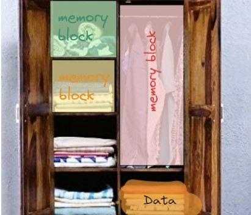
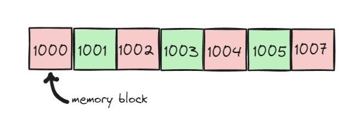

# Array in C++

In this article, you will learn all the concepts of Array in C++.
Not only concept, but also I give you some good-level questions along with solutions for your better level of understanding.
In this article, We will discuss declaration, initialization, accessing elements, and insertion and deletion operations on an array. After that one more article will be uploaded which contains some advanced information about Array.

So let's dive deep into the sea of programming and find some Pearl for your skills.

## 📒Introduction

First we need to know what an is array, okay so let's take a practical example - 
We all have a cupboard in our house, right!!
If I tell you that your cupboard is an array then what is your reaction? You may laugh at me, okay no problem I, 'll explain how..

Let's see what is the definition of the array

> <b> <em>  An array is a collection of data that holds values of the same type. It consists of multiple variables stored at contiguous memory locations.  </em> </b>

If we breakdown the definition into some points let's see what exactly the definition wants to say

> -  Array nothing but a box/container which stores data  (same type of data) 
> -  It's store multiple data at <b><em>contiguous memory location</b></em> 

Now let's compare with the example 
 

> -  In this cupboard we store our clothes (`data`)   We can store only clothes in our cupboard we don't store our kitchen items so in the cupboard we store `same type of data`
>-  We store cloth in separate selves (`one memory location`) and all selves are connected next to each other (`contiguous  memory location`).

<b>so we can say cupboard is also an Array. I think this example is clear to you to understand Array</b>

🌟**Contiguous Memory Location:**  As explained above contiguous memory location means `series of adjacent memory addresses in a computer's memory where data is stored sequentially.`
 

****
# 📒Declaration

